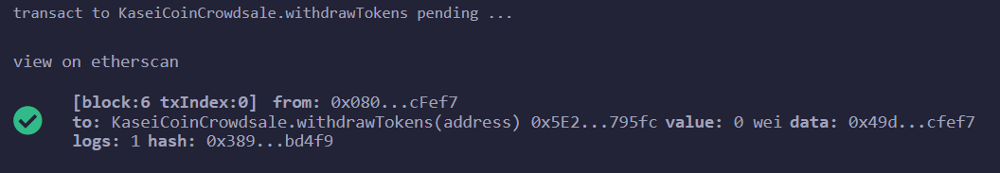

# Deployment and Crowdsale of Ethereum Standard Contract for ICO

This respository contains a demo example of the creation of an ERC-20 token smart contract utilizing Ethereum standards implemented through the use of OpenZeppelin Solidity libraries such as SafeMath, ERC20, ERC20Detailed, Crowdsale, MintedCrowdsale, TimedCrowdSale, and RefundablePostDeliveryCrowdsale.  

The demo is of a project to develop a monetary system for a new Mars colony. This new monetary system is based on blockchain technology with a new cryptocurrency called KaseiCoin defined (“Kasei” means “Mars” in Japanese).  KaseiCoin is a fungible token that is ERC-20 compliant.  The deployed contracts include a crowdsale that will allow people who are moving to Mars to convert their earthling money to KaseiCoin.  The crowdsale contract manages the entire crowdsale process, allowing users to send ether to the contract and in return receive MARS, or KaseiCoin tokens. The contract mints the tokens automatically and distributes them to buyers in one transaction after close.

## Technologies

The KaseiCoin monetary solution uses the following technologies:

- [Solidity](https://docs.soliditylang.org/en/latest/index.html)
- [OpenZeppelin](https://github.com/OpenZeppelin/openzeppelin-contracts) for smart contract development
- [Remix Integrated Development Environment](https://remix.ethereum.org) for Solidity contract development
- [Ganache](https://www.trufflesuite.com/ganache) local Ethereum blockchain for transaction orchestration and testing
- [MetaMask](https://metamask.io/) for wallet accounts, approvals/signing, and balance lookups

## Installation Guide

To run completely locally, this demo requires a functioning Remix development environment, a connected MetaMask wallet, and a running local Ethereum blockchain hosted by Ganache.  The following installation instructions assume basic understanding of Remix, Ganache, and MetaMask.

1. Install Ganache by following the instructions on the [Ganache download page](https://www.trufflesuite.com/ganache) to download and install this tool on your local machine. Note Ganache must be running for MetaMask to connect to it.

1. Install  MetaMask by following the instructions on the [MetaMask download page](https://metamask.io/download/).  If you don't have MetaMask installed already, the setup process will walk you through creating your initial MetaMask wallet. This initial wallet, or account, will not be used in this demo, but you should keep the seed phrase generated safe and highly secure.

1. Open [Remix](https://remix.ethereum.org) in your browser.

1. Clone this repository and upload *KaseiCoin.sol*, *KaseiCoinCrowdsale.sol*, and *KaseiCoinCrowdsaleDeployer.sol* into your Remix workspace using the *Load a file into current workspace* functionality.  Note you can also point Remix directly to a local drive using the *remixd* tool, but that is beyond the scope of this document.  More info on this topic can be found in the [Remix File Explorer documentation](https://remix-ide.readthedocs.io/en/latest/file_explorer.html).

1. Compile the three *.sol* files using the 0.5.5 Solidity compiler. This will compile the code and also bring in the OpenZeppelin dependencies.

    **Figure 1: KaseiCoin successful compilation:**

    

    **Figure 2: KaseiCoinCrowdsale successful compilation:**

    

    **Figure 3: KaseiCoinCrowdsaleDeployer successful compilation:**

    

1. Open Ganache, create an Ethereum workspace, and copy the RPC address, which should be HTTP://127.0.0.1:7545

1. In MetaMask create a new network called *Ethereum Local* with the following settings:

    - RPC: HTTP://127.0.0.1:7545  *(copied from step 6)*
    - Chain ID: 1337
    - Currency symbol: ETH

    **Figure 4: MetaMask network configuration for Ganache:**

   

1. Ensure MetaMask is set to the new *Ethereum Local* network. Import three accounts from the running instance of Ganache into MetaMask.  This can be accomplished by clicking the key icon next to a Ganache account, copying the private key, and importing it into MetaMask as a new account. To help easily distinguish the accounts, rename the accounts in MetaMask to MARS-1, MARS-2, and MARS-3.  Ensure your MetaMask is set to MARS-1.

    **Figure 5: Ganache private key retrieval for the first account:**
    

1. In Remix, select the *Injected Web3* environment.  This will prompt you to connect your MetaMask wallet to the Remix environment.  On the MetaMask prompt, give Remix access to MARS-1, MARS-2, and MARS-3.  The *Account* field in Remix should now be populated with your MARS-1 address.

    **Figure 6: Remix Web3 wallet connectivity environment:**
    

1. Deploy the KaseiCoinCrowdsaleDeployer contract with the following parameter values:

    - Name: Kasei
    - Symbol: MARS
    - Wallet: *wallet address of your MARS-1 account*
    - ConversionRateInWei: 1
    - SaleGoalInWei: 5000000000000000000  

    This sets a crowd sale goal of 5 ETH. Easy conversions from Wei <-> ETH can be done at the [Ethereum Unit Converter](https://eth-converter.com/).

    **Figure 7: KaseiCoinCrowdsaleDeployer contract parameter values for deployment:**
    

    Successful deployment will show confirmations in both Remix and Ganache.

    **Figure 8: Remix confirmation of successful KaseiCoinCrowdsaleDeployer contract deployment:**
    

    **Figure 9: Ganache confirmation of successful KaseiCoinCrowdsaleDeployer contract deployment:**
    

1. Next the *KaseCoinCrowdsale* contract will need to be visible in Remix so that you can interact with it.  The *KaseiCoinCrowdsaleDeployer* deployed this contract so you will need to import it by the contract's address on the live blockchain, which can be found by clicking the *KaseiCrowdSale* button (the first one) and copying the address presented and pasting it into the *At Address* input box in Remix.  Successful import will present the *KaseiCoinCrowdsale* pane in Remix's *Deployed Contracts* section. Note you may need to have the *KaseiCrowdSale* contract selected in the *Contracts* dropdown list.

    **Figure 10: KaseiCoinCrowdsale and KaseiCoin contract addresses from successful KaseiCoinCrowdsaleDeployer deployment:**
    

## Workflows

### Timed Crowdsale

Note that once the *KaseiCoinCrowdsaleDeployer* is deployed, you have 30 minutes to perform sample transactions before the sale closes.  This is a demo of functionality using the *TimedCrowdSale* library. The sale cannot be finalized until the time runs out. The beginning time and ending time are constructor inputs to *KaseiCoinCrowdsale* and set explicitly by *KaseiCoinCrowdsaleDeployer* as "now" and "now + 5 minutes".  If the sale ends and the crowdsale's goals are not met, addresses that contributed are eligible for a refund; otherwise the *finalize* method on the *KaseiCoinCrowdsale* contract can be called and contributing addresses are then eligible to execute the *withdrawTokens* method to retrieve their purchased tokens.

### Crowdsale meeting goals

The following workflow was performed:

1. MetaMask was switched to MARS-2 and the *buyTokens* method was executed, purchasing 3 ETH.

    **Figure 14: MetaMask confirmation of MARS-2 purchasing 3 ETH's worth of tokens:**  

      

    **Figure 15: Remix confirmation of Wei raised using weiRaised method:**

      

1. MetaMask was switched to MARS-3 and the *buyTokens* method was executed, purchasing 2 ETH.

    **Figure 16: MetaMask confirmation of MARS-3 purchasing 2 ETH's worth of tokens:**  

      

    **Figure 17: Remix confirmation of Wei raised using weiRaised method:**

    

   **Figure 18: Remix confirmation of Cap reached using capReached method:**

    

   **Figure 19: Remix confirmation of Goal reached using goalReached method:**

    

1. Import the KaseiCoin (MARS) token contract address in MetaMask so that MetaMask can understand it.  The contract address was obtained in step 11 in the last section.  

    **Figure 20: Importing KaseiCoin contract in MetaMask:**

    

1. With the goal reached, and the time expired, the contract was finalized by switching to the MARS-1 account in MetaMask and executing the *finalize* method in the *KaseiCoinCrowdsale* contract.

   **Figure 21: Remix confirmation of finalize method:**

    

   **Figure 22: Remix confirmation of finalized method:**

    

    With the contract finalized, the 5 ETH in proceeds go to the MARS-1 account.

   **Figure 23: MetaMask MARS-1 account showing an additional 5 ETH:**

    

1. The *withdrawTokens* method was called for both the MARS-2 and MARS-3 accounts to redeem the MARS tokens.

    **Figure 24: Remix MARS-2 account withdrawTokens confirmation:**

    

   **Figure 25: MetaMask MARS-2 account showing an additional 3 MARS:**

    

    **Figure 26: MetaMask MARS-3 account showing an additional 2 MARS:**

    

### Exceeding the cap error

No contributions can be made over the cap limit, which in this demo is set to 5 ETH.

- With any account before finalization, attempt to purchase tokens beyond the cap.

    **Figure 27: Transaction rejected because cap exceeded:**

    
